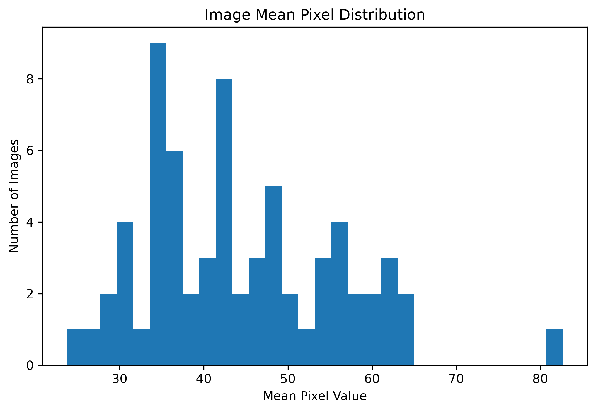
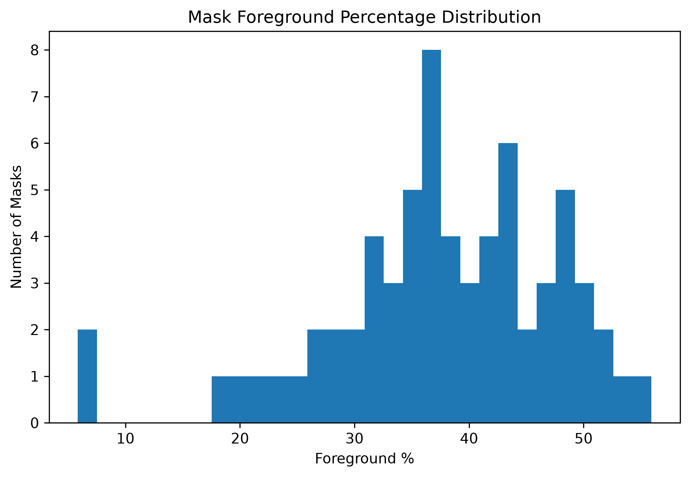
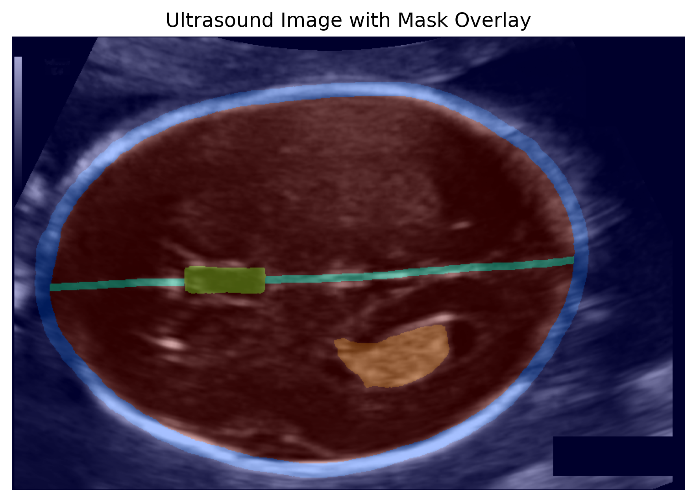

# Medical Image Analysis Pipeline

## Overview

This project implements an automated medical image analysis pipeline for ultrasound image datasets.

The pipeline performs:

* Dataset loading
* Dataset validation
* Image statistical analysis
* Segmentation mask analysis
* Visualization generation
* Automated report generation
* Logging and execution tracking

The goal of this project is to analyze medical images and their corresponding segmentation masks before further machine learning model development.

---

# Pipeline Status

✅ Dataset Loading
✅ Dataset Validation
✅ Image Statistical Analysis
✅ Mask/Segmentation Analysis
✅ Visualization Generation
✅ Logging System
✅ Automated Pipeline Execution

---

# Project Workflow

```text
Dataset
   |
   v
Dataset Loader
   |
   v
Dataset Validation
   |
   v
Image Analysis
   |
   v
Mask Analysis
   |
   v
Visualization Generation
   |
   v
Reports & Logs
```

---

# Dataset Structure

The input dataset contains:

```text
dataset/

├── images/
│   └── Ultrasound PNG images
│
├── labels/
│   └── Segmentation mask PNG images
│
├── dicom/
│   └── DICOM medical image files
│
└── pdfs/
    └── Supporting documents
```

---

# Project Structure

```text
origin-medical-challenge/

├── dataset/
│
├── src/
│   │
│   ├── analysis/
│   │   ├── dataset_loader.py
│   │   ├── image_analysis.py
│   │   ├── mask_analysis.py
│   │   ├── statistics.py
│   │   └── visualization.py
│   │
│   ├── Validation/
│   │   └── dataset_validator.py
│   │
│   ├── deidentify/
│   │   ├── dicom_processor.py
│   │   ├── metadata_extractor.py
│   │   ├── pdf_processor.py
│   │   └── pipeline.py
│   │
│   └── utils/
│       └── helpers.py
│
├── figures/
│   ├── image_mean_distribution.png
│   ├── mask_foreground_distribution.png
│   ├── image_dimensions.png
│   └── sample_mask_overlay.png
│
├── logs/
│   └── pipeline.log
│
├── image_analysis.csv
├── mask_analysis.csv
├── dataset_validation.csv
│
├── main.py
├── config.py
├── logger_config.py
├── requirements.txt
└── README.md
```

---

# Features

## 1. Dataset Validation

The validation module checks dataset quality before performing analysis.

Validation includes:

* Image count verification
* Mask count verification
* Missing image-mask pair detection
* Image and mask dimension consistency
* Empty segmentation mask detection
* Corrupt file checking

Generated report:

```text
dataset_validation.csv
```

Example output:

```text
Image count : PASS
Mask count : PASS
Dimension mismatch : PASS
Empty masks : PASS
```

---

# 2. Image Analysis

The image analysis module extracts statistical information from ultrasound images.

For every image, the pipeline calculates:

* Filename
* Image width
* Image height
* Image mode
* Minimum pixel intensity
* Maximum pixel intensity
* Mean pixel intensity
* Pixel standard deviation

Generated report:

```text
image_analysis.csv
```

Example:

```text
filename        width   height   mean_pixel

003_HC.png      800     540      45.55
005_HC.png      800     540      63.01
```

---

# 3. Mask Analysis

The mask analysis module evaluates segmentation annotations.

For every mask, it calculates:

* Mask dimensions
* Foreground pixel count
* Background pixel count
* Foreground percentage

Generated report:

```text
mask_analysis.csv
```

Example:

```text
filename                  foreground_percentage

003_HC_Annotation.png    55.92
005_HC_Annotation.png    37.33
```

---

# 4. Visualization

The visualization module generates graphical summaries from analysis reports.

Generated visualizations:

## Image Mean Pixel Distribution

Shows the intensity distribution across ultrasound images.

Output:

```text
figures/image_mean_distribution.png
```

---

## Mask Foreground Distribution

Shows segmentation coverage distribution across masks.

Output:

```text
figures/mask_foreground_distribution.png
```

---

## Image Dimension Distribution

Checks image resolution consistency.

Output:

```text
figures/image_dimensions.png
```

---

## Mask Overlay Visualization

Creates image-mask overlays to visually verify segmentation alignment.

Output:

```text
figures/sample_mask_overlay.png
```

---

# Results & Visualizations

## Image Mean Distribution



## Mask Foreground Distribution



## Image Mask Overlay



---

# Logging System

The pipeline includes a logging system for execution tracking.

Logs include:

* Pipeline start
* Dataset validation status
* Analysis completion
* Visualization completion
* Errors and warnings

Generated log:

```text
logs/pipeline.log
```

Example:

```text
INFO - PIPELINE STARTED
INFO - Dataset validation completed
INFO - Image analysis completed
INFO - Visualization completed successfully
```

---

# Installation

## Clone Repository

```bash
git clone https://github.com/Kareem1725/origin-medical-challenge.git
```

## Navigate into Project

```bash
cd origin-medical-challenge
```

## Create Virtual Environment

```bash
python -m venv .venv
```

## Activate Environment

Windows:

```bash
.venv\Scripts\activate
```

## Install Dependencies

```bash
pip install -r requirements.txt
```

---

# Running the Pipeline

Execute:

```bash
python main.py
```

The complete pipeline automatically performs:

* Dataset loading
* Dataset validation
* Image analysis
* Mask analysis
* Visualization generation
* Logging

---

# Generated Outputs

After successful execution:

```text
origin-medical-challenge/

├── image_analysis.csv
│
├── mask_analysis.csv
│
├── dataset_validation.csv
│
├── figures/
│
└── logs/
```

---

# Technologies Used

* Python
* NumPy
* Pandas
* Pillow (PIL)
* Matplotlib
* CSV Processing
* Logging
* YAML Configuration

---

# Dataset Validation Observation

The provided dataset was analyzed without modifying the original files.

During validation, one unmatched image-mask pair was detected:

```text
Missing Mask:
230_2HC

Missing Image:
231_HC
```

The issue is reported through validation logs and CSV reports.

---

# Future Improvements

Possible future extensions:

* DICOM metadata extraction pipeline
* Automated PDF report generation
* Data augmentation pipeline
* Deep learning segmentation model integration
* U-Net based segmentation training

Model evaluation metrics:

* Dice Score
* IoU
* Precision
* Recall
